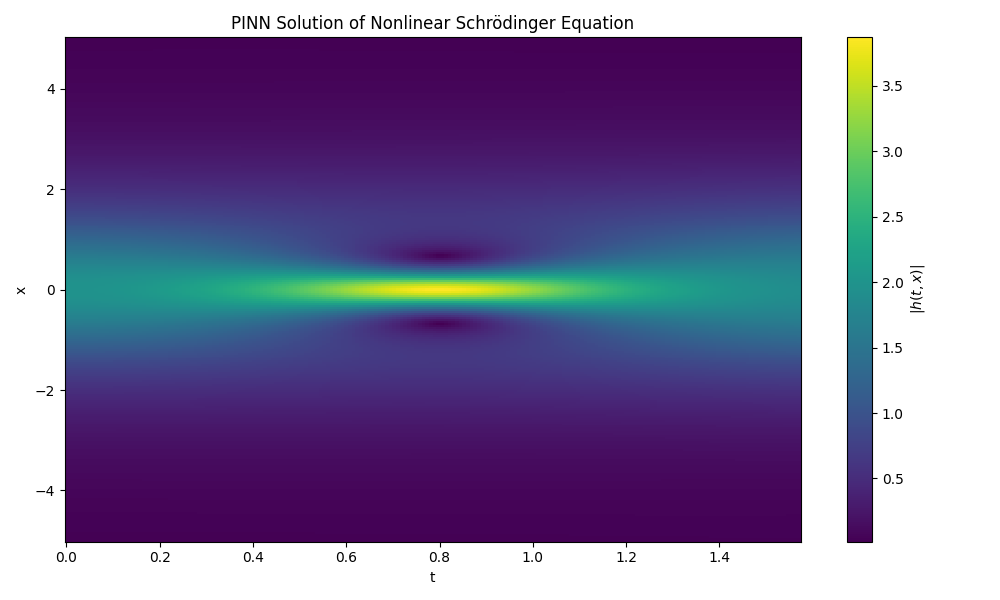

# Physics-Informed Neural Network (PINN)
## Nonlinear Schrodinger Equation Solver (PyTorch + GPU)

---

## Overview

This project implements a Physics-Informed Neural Network (PINN) to solve the one-dimensional nonlinear Schrodinger equation:

i h_t + 0.5 h_xx + |h|^2 h = 0

over the domain:

- x ∈ [-5, 5]
- t ∈ [0, π/2]

The model learns the full spatio-temporal complex solution using only the initial condition and physics constraints. No labeled dataset is required.

---

## Key Idea

The complex solution is decomposed as:

h(t,x) = u(t,x) + i v(t,x)

The neural network predicts:

[u(t,x), v(t,x)]

Training is performed by minimizing:

- Initial condition loss  
- PDE residual loss at collocation points  

The Schrodinger equation is enforced using automatic differentiation.

---

## Features

- Complex-valued PDE solving
- Physics-based learning (no dataset required)
- Automatic differentiation with PyTorch
- GPU acceleration support
- Continuous solution representation
- Modular project structure

---

## Project Structure

PINN_SCHRODINGER/
│
├── src/
│   ├── model.py
│   ├── physics.py
│   ├── data.py
│   ├── train.py
│   └── visualize.py
│
├── main.py
├── requirements.txt
└── result_Figure_1.png

---

## Result

The magnitude of the learned solution

|h(t,x)| = sqrt(u² + v²)

is shown below:

The model captures the localized soliton-like behavior of the nonlinear Schrodinger equation.

---

## How to Run

1. Clone the repository:

git clone <copy_my_project_url>
cd pinn-schrodinger

2. Install dependencies:

pip install -r requirements.txt

3. Run training and visualization:

python main.py

If a GPU is available, the model automatically runs on CUDA.

---

## Technologies Used

- Python
- PyTorch
- NumPy
- Matplotlib

---

## Reference

Raissi, M., Perdikaris, P., & Karniadakis, G. (2019).
Physics-Informed Neural Networks: A Deep Learning Framework for Solving Forward and Inverse Problems Involving Nonlinear PDEs.
Journal of Computational Physics.

---

## Summary

This project demonstrates how neural networks can act as continuous function approximators to solve nonlinear partial differential equations by embedding physical laws directly into the loss function.

It combines deep learning, numerical methods, and physics-based modeling into a unified framework.
